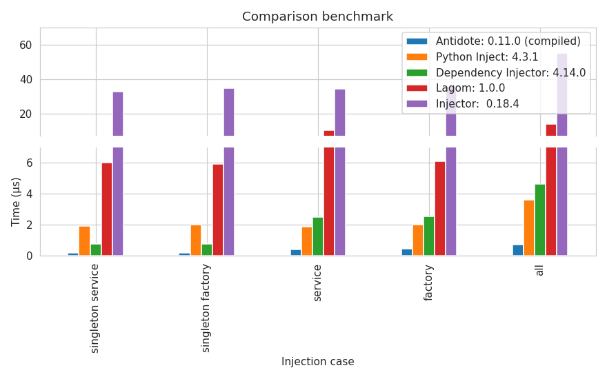

********
Antidote
********

.. image:: https://img.shields.io/pypi/v/antidote.svg
  :target: https://pypi.python.org/pypi/antidote

.. image:: https://img.shields.io/pypi/l/antidote.svg
  :target: https://pypi.python.org/pypi/antidote

.. image:: https://img.shields.io/pypi/pyversions/antidote.svg
  :target: https://pypi.python.org/pypi/antidote

.. image:: https://github.com/Finistere/antidote/actions/workflows/main.yml/badge.svg?branch=master
  :target: https://github.com/Finistere/antidote/actions/workflows/main.yml

.. image:: https://codecov.io/gh/Finistere/antidote/branch/master/graph/badge.svg
  :target: https://codecov.io/gh/Finistere/antidote

.. image:: https://readthedocs.org/projects/antidote/badge/?version=latest
  :target: http://antidote.readthedocs.io/en/latest/?badge=latest

Antidotes is a dependency injection micro-framework for Python 3.7+. It is built on the
idea of ensuring best **maintainability** of your code while being as **easy to use** as possible.
It also provides the **fastest** injection with :code:`@inject` allowing you to use it virtually anywhere
and **fast full isolation of your tests**.

Antidote provides the following features:

- Ease of use
    - Injection anywhere you need through a decorator :code:`@inject`
    - No :code:`**kwargs` arguments hiding actual arguments and fully mypy typed, helping you and your IDE.
    - `Documented <https://antidote.readthedocs.io/en/latest>`_, everything has tested examples.
    - No need for any custom setup, just use your injected function as usual. You just don't have to specify
      injected arguments anymore. Allowing you to gradually migrate an existing project.
- Flexibility
    - Most common dependencies out of the box: services, configuration, factories, interface/implementation.
    - All of those are implemented on top of the core implementation. If Antidote doesn't provide what you need, there's
      a good chance you can implement it yourself.
    - Scope support
    - Async injection
- Maintainability
    - All dependencies can be tracked back to their declaration/implementation easily.
    - Mypy compatibility and usage of type hints as much as possible.
    - Overriding dependencies will raise an error outside of tests.
    - Dependencies can be frozen, which blocks any new declarations.
    - No double injection.
    - Everything is as explicit as possible, :code:`@inject` does not inject anything implicitly.
    - Type checks when a type is explicitly defined with :code:`world.get` and constants.
    - Thread-safe, cycle detection.
    - Immutable whenever possible.
- Testability
    - :code:`@inject` lets you override any injections by passing explicitly the arguments.
    - Fully isolate each test with :code:`world.test.clone`. They will work on separate objects.
    - Override globally any dependency locally in a test.
    - When encountering issues you can retrieve the full dependency tree, nicely formatted, with :code:`world.debug`.
- Performance\*
    - Fastest :code:`@inject` with heavily tuned Cython.
    - As much as possible is done at import time.
    - Testing utilities are tuned to ensure that even with full isolation it stays fast.
    - Benchmarks:
      `comparison <https://github.com/Finistere/antidote/blob/master/comparison.ipynb>`_,
      `injection <https://github.com/Finistere/antidote/blob/master/benchmark.ipynb>`_,
      `test utilities <https://github.com/Finistere/antidote/blob/master/benchmark_test_utils.ipynb>`_

*\*with the compiled version, in Cython. Pre-built wheels for Linux. See further down for more details.*

Installation
============

To install Antidote, simply run this command:

.. code-block:: bash

    pip install antidote

Documentation
=============

Beginner friendly tutorial, recipes, the reference and a FAQ can be found in the
`documentation <https://antidote.readthedocs.io/en/latest>`_.

Here are some links:

- `Why dependency injection ? <https://antidote.readthedocs.io/en/latest/faq.html#why-dependency-injection>`_
- `Why use a dependency injection framework ? <https://antidote.readthedocs.io/en/latest/faq.html#why-use-a-dependency-injection-framework>`_
- `Why choose Antidote ? <https://antidote.readthedocs.io/en/latest/faq.html#why-choose-antidote>`_ (comparing to other libraries, among which is `dependency_injector <https://python-dependency-injector.ets-labs.org/index.html>`_)
- `Getting Started <https://antidote.readthedocs.io/en/latest/tutorial.html#getting-started>`_
- `Changelog <https://antidote.readthedocs.io/en/latest/changelog.html>`_

Issues / Questions
==================

Feel free to open an issue on Github for questions or issues !

Hands-on quick start
====================

Showcase of the most important features of Antidote with short and concise examples.
Checkout the `Getting started`_ for a full beginner friendly tutorial.

Injection
---------

.. code-block:: python

    from antidote import inject, injectable

    @injectable
    class Database:
        pass

    @inject
    def f(db: Database = inject.me()):
        return db

    assert isinstance(f(), Database)  # works !

Simple, right ? And you can still use it like a normal function, typically when testing it:

.. code-block:: python

    f(Database())

:code:`@inject` here used the marker :code:`inject.me()` with the help of the type hint to determine
the dependency. But it also supports the following ways to express the dependency wiring:

- annotated type hints:
    .. code-block:: python

        from antidote import Inject

        @inject
        def f(db: Inject[Database]):
            pass

- list (matching argument position):
    .. code-block:: python

        @inject([Database])
        def f(db):
            pass

- mapping:
    .. code-block:: python

        @inject({'db': Database})
        def f(db):
            pass

- optional dependencies:
    .. code-block:: python

        from typing import Optional

        class Dummy:
            pass

        # When the type_hint is optional and a marker like `inject.me()` is used, None will be
        # provided if the dependency does not exists.
        @inject
        def f(dummy: Optional[Dummy] = inject.me()):
            return dummy

        assert f() is None

You can also retrieve the dependency by hand with :code:`world.get`:

.. code-block:: python

    from antidote import world

    # Retrieve dependencies by hand, in tests typically
    world.get(Database)
    world.get[Database](Database)  # with type hint, enforced when possible

Injectable
----------

Any class marked as `@injectable` can be provided by Antidote. It can be a singleton or not.
Scopes and a factory method are also supported. Every method is injected by default, relying on
annotated type hints and markers such as :code:`inject.me()`:

.. code-block:: python

    from antidote import injectable, inject

    @injectable(singleton=False)
    class QueryBuilder:
        # methods are also injected by default
        def __init__(self, db: Database = inject.me()):
            self._db = db

    @inject
    def load_data(builder: QueryBuilder = inject.me()):
        pass

    load_data()  # yeah !

Constants
---------

Constants can be provided lazily by Antidote:

.. code-block:: python

    from antidote import inject, const

    class Config:
        DB_HOST = const('localhost')
        DB_PORT = const(5432)

    @inject
    def ping_db(db_host: str = Config.DB_HOST):
        pass

    ping_db()  # nice !

Constants really shines when they aren't hard-coded:

.. code-block:: python

    from typing import Optional

    class Config:
        # Retrieve constant from environment variables
        DB_HOST = const.env()  # using the constant name
        # or with an explicit name, default value, and forced conversion to int
        # (and other selected types)
        DB_PORT = const.env[int]("DATABASE_PORT", default=5432)

    import os
    os.environ['DB_HOST'] = 'localhost'
    os.environ['DATABASE_PORT'] = '5432'

    @inject
    def check_connection(db_host: str = Config.DB_HOST,
                         db_port: int = Config.DB_PORT):
        pass

    check_connection()  # perfect !

Note that on the injection site, nothing changed! And obviously you can create your own logic:

.. code-block:: python

    from antidote import const

    @const.provider
    def static(name: str, arg: Optional[str]) -> str:
        return arg

    class Config:
        DB_HOST = static.const('localhost')

Stateful configuration is also possible:

.. code-block:: python

    from antidote import injectable, const

    @injectable
    class Config:
        def __init__(self):
            self.data = {'host': 'localhost'}

        @const.provider
        def get(self, name: str, arg: Optional[str]) -> str:
            return self.data[arg]

        DB_HOST = get.const('host')

Lazy
----

Lazy functions can be used in multiple cases:

- to load external classes:

.. code-block:: python

    from antidote import lazy, inject

    class Redis:
        pass

    @lazy  # singleton by default
    def load_redis() -> Redis:
        return Redis()

    @inject
    def task(redis = load_redis()):
        ...

- as a factory:

.. code-block:: python

    from antidote import lazy, inject

    class User:
        pass

    @lazy(singleton=False)
    def current_user(db: Database = inject.me()) -> User:
        return User()

    @inject
    def is_admin(user: User = current_user()):
        pass

- or even to parameterize dependencies:

.. code-block:: python

    from dataclasses import dataclass
    from antidote import lazy, inject

    @dataclass
    class Template:
        path: str

    @lazy
    def load_template(path: str) -> Template:
        return Template(path=path)

    @inject
    def registration(template: Template = load_template('registration.html')):
        pass

Interface/Implementation
------------------------

Antidote also works with interfaces which can have one or multiple implementations which
can be overridden:

.. code-block:: python

    from antidote import implements, inject, interface, world

    @interface
    class Task:
        pass

    @implements(Task).by_default
    class Default(Task):
        pass

    @implements(Task)
    class Custom(Task):
        pass

    world.get(Task)

    @inject
    def f(task: Task = inject.me()) -> Task:
        return task

Implementations support qualifiers out of the box:

.. code-block:: python

    import enum

    class Hook(enum.Enum):
        START = enum.auto()
        STOP = enum.auto()

    @interface
    class Task:
        pass

    @implements(Task).when(qualified_by=Hook.START)
    class StartX(Task):
        pass

    @implements(Task).when(qualified_by=Hook.STOP)
    class StopX(Task):
        pass

    assert world.get[Task].single(qualified_by=Hook.START) == world.get(StartX)
    assert world.get[Task].all(qualified_by=Hook.START) == [world.get(StartX)]

    @inject
    def get_single_task(task: Task = inject.me(qualified_by=Hook.START)) -> Task:
        return task

    @inject
    def get_all_task(tasks: list[Task] = inject.me(qualified_by=Hook.START)) -> list[Task]:
        return tasks

Testing and Debugging
---------------------

:code:`inject` always allows you to pass your own argument to override the injection:

.. code-block:: python

    from antidote import injectable, inject

    @injectable
    class Database:
        pass

    @inject
    def f(db: Database = inject.me()):
        pass

    f()
    f(Database())  # test with specific arguments in unit tests

You can also fully isolate your tests from each other and override any dependency within
that context:

.. code-block:: python

    from antidote import world

    # Clone current world to isolate it from the rest
    with world.test.clone():
        x = object()
        # Override the Database
        world.test.override.singleton(Database, x)
        f()  # will have `x` injected for the Database

        @world.test.override.factory(Database)
        def override_database():
            class DatabaseMock:
                pass

            return DatabaseMock()

        f()  # will have `DatabaseMock()` injected for the Database

If you ever need to debug your dependency injections, Antidote also provides a tool to
have a quick summary of what is actually going on:

.. code-block:: python

    def function_with_complex_dependencies():
        pass

    world.debug(function_with_complex_dependencies)
    # would output something like this:
    """
    function_with_complex_dependencies
    └──<∅> IMDBMovieDB
        └── ImdbAPI
            └── load_imdb
                ├── Config.IMDB_API_KEY
                ├── Config.IMDB_PORT
                └── Config.IMDB_HOST

    Singletons have no scope markers.
    <∅> = no scope (new instance each time)
    <name> = custom scope
    """

Hooked ? Check out the `documentation <https://antidote.readthedocs.io/en/latest>`_ !
There are still features not presented here !

Compiled
========

The compiled implementation is roughly 10x faster than the Python one and strictly follows the
same API than the pure Python implementation. Pre-compiled wheels are available only for Linux currently.
You can check whether you're using the compiled version or not with:

.. code-block:: python

    from antidote import is_compiled
    
    f"Is Antidote compiled ? {is_compiled()}"

You can force the compilation of antidote yourself when installing:

.. code-block:: bash

    ANTIDOTE_COMPILED=true pip install antidote
    
On the contrary, you can force the pure Python version with:

.. code-block:: bash

    pip install --no-binary antidote

.. note::

    The compiled version is not tested against PyPy. The compiled version relies currently on Cython,
    but it is not part of the public API. Relying on it in your own Cython code is at your risk.

How to Contribute
=================

1. Check for open issues or open a fresh issue to start a discussion around a
   feature or a bug.
2. Fork the repo on GitHub. Run the tests to confirm they all pass on your
   machine. If you cannot find why it fails, open an issue.
3. Start making your changes to the master branch.
4. Writes tests which shows that your code is working as intended. (This also
   means 100% coverage.)
5. Send a pull request.

*Be sure to merge the latest from "upstream" before making a pull request!*

If you have any issue during development or just want some feedback, don't hesitate
to open a pull request and ask for help !

Pull requests **will not** be accepted if:

- public classes/functions have not docstrings documenting their behavior with examples.
- tests do not cover all of code changes (100% coverage) in the pure python.

If you face issues with the Cython part of Antidote, I may implement it myself.
